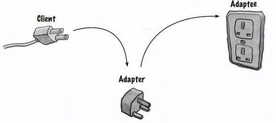

### What is the Adapter Pattern?

The Adapter pattern is a structural design pattern that allows incompatible interfaces to work together. It acts as a
bridge between two incompatible interfaces, making them compatible.

### Key Components:

- **Target:** Defines the specific interface the client expects.
- **Adaptee:** The existing interface that needs to be adapted.
- **Adapter:** The class that adapts the Adaptee interface to the Target interface.

### Benefits of the Adapter Pattern:

- Reusability of existing code.
- Improved code organization and maintainability.
- Increased flexibility by decoupling clients from specific implementations.

### Additional Considerations:

- There are two primary types of adapters: object adapters (using composition) and class adapters (using inheritance).
- The Adapter pattern can be used in various scenarios, such as integrating third-party libraries, adapting legacy
  systems to new interfaces, and providing different views of the same data.

### Programmatic Example of Adapter Pattern in Java

Consider a wannabe captain that can only use rowing boats but can't sail at all. Now, let's say the pirates are coming
and our captain needs to escape but there is only a fishing boat available. We need to create an adapter that allows the
captain to operate the fishing boat with his rowing boat skills.

### In conclusion

By understanding and applying the Adapter pattern, you can effectively bridge the gap between incompatible interfaces
and create more flexible and maintainable software systems.
